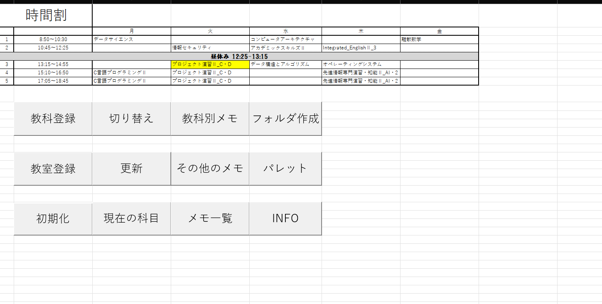
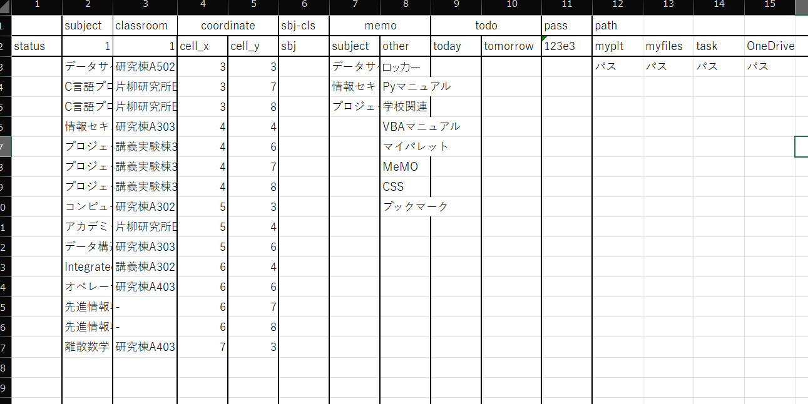
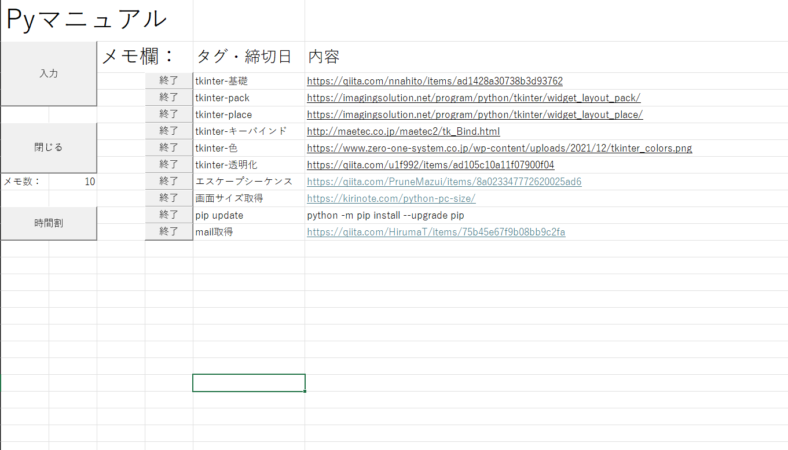
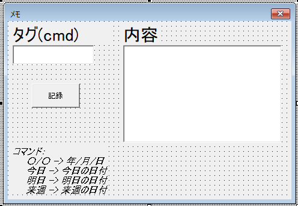

# MeMO

Excelでメモ、タスクを管理する **マイパレット**を使うことで画面に **明日/今日までのタスク** を画面に表示させることができる

> マイパレット： [OJAHU/MyPalette](https://github.com/OJAHU/MyPalette)

---

## 主な内容

- **タスク入力フォーム**：締切・見出し / メモ をGUIで登録
- **メモシート**：授業・課題のメモを一覧で整理
- **時間割表示**：週単位の予定表示

---

## スクリーンショット

- 時間割シート  
  

- Infoシート
　

- メモシート例  
  

- タスク入力フォーム  
  

---

## 時間割シート

 - 教科登録
   * Module1 -> Sub 教科確定ボタン_Click()
   * 仕様
     時間割表に教科を入力した後、このボタンをクリックするとInfoシートに登録してくれる
  
 - 教室登録
   * Module1 -> Sub 教室確定ボタン_Click()
   * 仕様
     登録された教科を参照し、for文で入力ボックスを出してInfoシートに登録してくれる
      
 - 初期化
   * Module1 -> Sub 初期化_Click()
   * 仕様
     Infoシートに登録された教科・教室を消して初期化する
     
 - 切り替え
   * Module1 -> Sub 教科切り替えボタン_Click()
   * 仕様
     時間割表の 教科/教室 表示を切り替える
     
 - 更新
   * Module1 -> Sub 更新ボタン_Click()
   * 仕様
     色付けを初期化し、各メモから タグ・締切日 の項目を読み込み、日付が今日か明日なら、メモ・時間割表の対応する場所の背景を色づけする。今日までの場合は赤、明日までの場合はピンクに色付けされる
     
 - 現在の科目
   * Module1 -> Sub 現在表示ボタン_Click()
   * 仕様
     現在の曜日と時間を取得し、時間割表の対応する曜日と時間のところを色づけする
     
 - 教科別メモ
   * Module1 -> Sub メモ作成ボタン_Click()
   * 仕様
     アクティブセルから値を取得し、それが登録された教科なら新しくメモを作成する
     
 - その他のメモ
   * Module1 -> Sub その他のメモ作成ボタン_Click()
   * 仕様
     入力ボックスを表示し、シート名の入力を促して新しくメモを作成する
     
 - メモ一覧
   * Module1 -> Sub メモ一覧_Click()
   * 仕様
     すべてのメモ名を一覧で表示するシートを作成する。シートを離れるとき、これを削除する。
     
 - フォルダ作成
   * Module1 -> Sub フォルダ作成ボタン_Click()
   * 仕様
     登録した教科のディレクトリを現在のパスで作成する。OneDriveのパスだとurlの形式が参照されてしまうエラーが起きてしまうため、 Module3 -> Function GetPath() を呼び出し、参照できるパスの形式にする
     
 - パレット
   * Module1 -> 通知ボタン_Click()
   * 仕様
     別プログラムのマイパレットを呼び出す
     
 - INFO
   * Module1 -> Info表示_Click()
   * 仕様
     入力ボックスを表示し、パスワード入力を促す。Infoシートに登録されたパスワードなら、Infoシートを表示する。Infoシートは離れたら非表示になる

---

## 各メモシート

- 入力
  * Module2 -> Sub write_memo()
  * 仕様
    ユーザフォームを呼び出して表示する
    
- 閉じる
  * Module2 -> Sub ws_delete()
  * 仕様
    メモ数が0であれば、このメモシートを削除する
    
- 時間割
  * Module2 -> Sub go_home()
  * 仕様
    時間割シートに移動する
    
- 終了
  * Module2 -> Sub close_memo()
  * 仕様
    同じ行のタスクを削除する

---

## ユーザフォーム

* UserForm1.frm -> CommandButton1_Click()
* 仕様
  ボタンをクリックしたら内容の項目が空欄でなければ、タグ・締切日と一緒にメモのシートに登録する

---

## Infoシート

 * Sheet2 -> Sub worksheet_deactivate()
 * 仕様
   Infoシートを離れたら非表示にする

---

## workbook

* ThisWorkbook -> Sub Workbook_Open()
* 仕様
  MeMOを開いたら、更新ボタン_Click と 現在表示ボタン_Click を呼び出す
